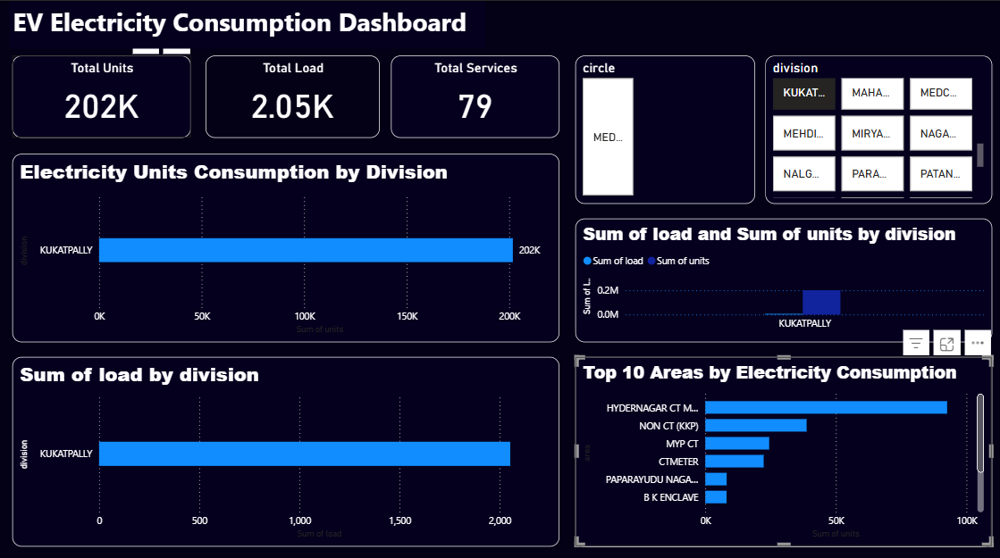

EV Electricity Consumption Dashboard

Project Overview

This project analyzes electricity consumption data across different divisions and areas using Power BI. The goal is to identify usage patterns, high-demand regions, and compare electricity load with actual consumption.

Tools Used

 Power BI
 Data Visualization
 Data Cleaning

Key Insights

- Identified top electricity-consuming divisions such as Kukatpally
- Highlighted areas with high electricity usage
- Compared load vs units to detect overloaded regions
- Found top 10 areas contributing to electricity consumption

Features

- KPI Cards (Total Units, Load, Services)
- Division-wise analysis
- Units vs Load comparison
- Top areas analysis
- Interactive filters (Circle, Division)

- 
